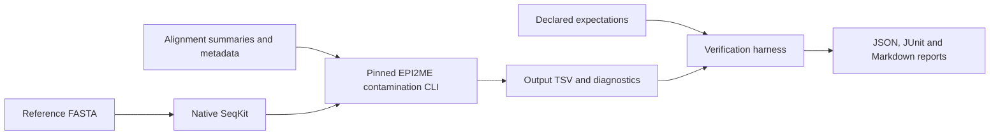

# EPI2ME AAV QC verification

Automated verification of the EPI2ME `wf-aav-qc` contamination-summary component,
with controlled fixtures, requirement-to-test traceability and reproducible
boundary-case investigations.

## Overview

The suite invokes Oxford Nanopore's unmodified contamination CLI with real
NumPy, pandas and native SeqKit. Small alignment tables make the expected
counts and percentages independently inspectable. The upstream source is
pinned to `wf-aav-qc` v1.3.1, commit
[`43a4266fc30a131c9e2b49654a97a3fd59e41d94`](https://github.com/epi2me-labs/wf-aav-qc/tree/43a4266fc30a131c9e2b49654a97a3fd59e41d94).

## Documentation

| Document | Contents |
|---|---|
| [Project scope](docs/project-scope.md) | Architecture, verification layers and boundaries |
| [Test plan](docs/component-test-plan.md) | Requirements, acceptance criteria and traceability |
| [Verification report](docs/component-case-study.md) · [PDF](output/pdf/epi2me-component-case-study.pdf) | Method, results and interpretation |
| [Component execution report](evidence/component-20260911-01/report.md) | Per-case receipts, inputs, outputs and diagnostics |
| [OBS-002](docs/observation-002.md) | Inconsistent total-read metadata and impossible percentages |
| [Risk review](docs/component-risk-review.md) | Failure modes, proposed controls and review status |
| [Setup and reproduction](LOCAL_START.md) | Windows and Linux commands |

## Recorded results

The committed local evidence was generated on 11 September 2026:

| Check | Outcome |
|---|---|
| Component contracts C01–C08 | 8 PASS |
| Exploratory probes X01–X04 | 4 observations, assessed separately from contracts |
| Harness unit tests | 28 PASS |
| FASTQ validator challenge | 12 true positives, 8 true negatives, 0 false positives/negatives |
| Local samtools/bcftools exercise | BLOCKED: executables unavailable |
| Complete Nextflow workflow on Eddie | NOT_RUN: container preparation ran out of memory |

The badges above report current CI status. Dated local reports describe their
recorded environments; later CI runs have separate logs and artifacts. The
first Linux CI run passed the component checks but failed during file-tool
verification; the failure remains open for investigation.

**C02 — read counts and alignment counts:** adding a repeated alignment changes
95 rows to 96 while the number of distinct mapped reads stays at 95. Transgene
alignment share changes from 80/95 (84.21%) to 81/96 (84.38%); the mapped-read
percentage stays at 95%.
[Expectation](evidence/component-20260911-01/C02/expectation.json) ·
[Output](evidence/component-20260911-01/C02/output.tsv)

**X03 — inconsistent metadata:** 95 distinct mapped reads with a declared total
of 94 produced a successful exit, −1 unmapped read and 101.0638% mapped.
The observation is reproducible at the component boundary. Whether upstream
workflow processing can supply these inputs remains unverified.
[Receipt](evidence/component-20260911-01/X03/receipt.json) ·
[Output](evidence/component-20260911-01/X03/output.tsv)

## Run the checks

Use Python 3.12 on Windows or Linux x86-64. Follow
[LOCAL_START.md](LOCAL_START.md) to create an isolated environment, install the
pinned dependencies and checksum-verified SeqKit, then run the suite. Component
tests do not require containers, an HPC allocation or the full demo dataset.

Each execution creates a new evidence directory with declared expectations,
inputs, commands, exit codes, diagnostics and hashes. Record technical review
separately from generated results. Independent review remains pending.

## Scope and provenance

The executed component suite begins downstream of alignment. It does not run
assembly, variant calling or the complete Nextflow workflow. The
[Eddie workflow extension](WORKFLOW_EXTENSION.md) is prepared but remains
unexecuted. [OBS-001](docs/observation-001.md) documents a separate input anomaly
in the original simulated-read dataset.

The FASTQ benchmark covers 20 authored files in a restricted four-line
A/C/G/T/N, Phred+33 dialect. Positive means a malformed file. Its 12/12
sensitivity and 8/8 specificity describe those fixtures, not independent
population-level or clinical accuracy. Acceptance criteria derive from source
inspection and project properties, not an approved upstream specification.

Source/input/output hashes and anonymisation details are documented in
[PUBLIC_EXPORT.md](PUBLIC_EXPORT.md) and the accompanying manifest. Upstream
code retains its [original licence](upstream/LICENSE) and
[source manifest](upstream/SOURCE.json). See [NOTICE.md](NOTICE.md) for attribution
and development assistance. This project has no clinical validation or medical
device certification.
