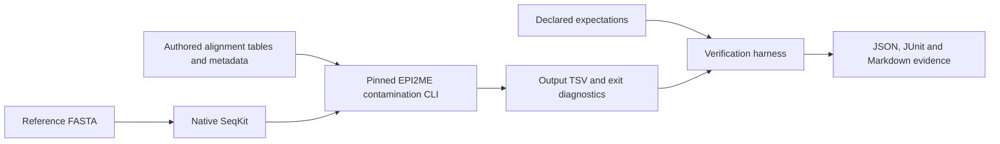

# EPI2ME AAV QC component verification

A bioinformatics software-testing portfolio examining counts, percentages and
failure handling in the real EPI2ME `wf-aav-qc` contamination-summary component.
Small synthetic inputs make every expected result inspectable by hand.

**Recorded on 11 September 2026: 8 component contract checks passed, 4 exploratory
observations recorded, and 28 verification-harness unit tests passed.**
The complete Nextflow workflow has not run successfully in this project.

## Start with the evidence

| Read | What it shows |
|---|---|
| [Two-page case study](output/pdf/epi2me-component-case-study.pdf) · [Markdown version](docs/component-case-study.md) | Problem, method, measured results and limitations; draft for applicant review |
| [Component test report](evidence/component-20260911-01/report.md) | All 8 contract checks and 4 observations, linked to execution receipts |
| [Requirements and test plan](docs/component-test-plan.md) | Requirements → software component → acceptance criteria → test evidence |
| [OBS-002 investigation](docs/observation-002.md) | A successful component exit with a negative unmapped-read count |
| [Job-skills map](docs/skills-map.md) | Evidence for the target role and remaining gaps |
| [Reproduction guide](LOCAL_START.md) | Setup and commands for Windows and Linux |

## What was tested

The target is Oxford Nanopore's unmodified `wf-aav-qc` v1.3.1 source at commit
[`43a4266fc30a131c9e2b49654a97a3fd59e41d94`](https://github.com/epi2me-labs/wf-aav-qc/tree/43a4266fc30a131c9e2b49654a97a3fd59e41d94).
The harness invokes its CLI with real NumPy, pandas and native SeqKit. Source
hashes, input hashes, expectations, outputs and diagnostics are retained.

The component boundary is downstream of alignment. Alignment, assembly,
variant calling and the complete EPI2ME report are outside this executed scope.
Acceptance criteria are inferred from source and project properties; they are
not employer-approved product requirements.

## Results and interpretation

| Activity | Recorded outcome | Evidence |
|---|---|---|
| Component contracts C01–C08 | 8 PASS | [Report](evidence/component-20260911-01/report.md) |
| Exploratory probes X01–X04 | 4 OBSERVATION; separate from pass/fail contracts | [Investigation](docs/observation-002.md) |
| Harness unit tests | 28 PASS | [Test log](evidence/component-harness-tests-20260911.txt) |
| FASTQ validator challenge | 12 true positives, 8 true negatives, 0 false positives/negatives | [Benchmark](evidence/validator-20260911-01/report.md) |
| samtools/bcftools exercise | BLOCKED locally: tools unavailable | [Recorded status](evidence/file-tools-local-20260911-01/report.md) |
| Complete Nextflow workflow on Eddie | NOT_RUN; container preparation ran out of memory | [Environment record](evidence/eddie-environment.md) |
| GitHub Actions | Configuration prepared; no remote result recorded in this snapshot | [Workflow](.github/workflows/component.yml) |

**Why C02 matters:** repeating an alignment increases the table from 95 to 96
rows, but leaves 95 distinct mapped reads. Transgene alignment share changes
from 80/95 (84.21%) to 81/96 (84.38%); mapped-read percentage stays at 95%.
This tests whether different denominators are interpreted correctly.
[Inspect the expected values](evidence/component-20260911-01/C02/expectation.json)
and [actual output](evidence/component-20260911-01/C02/output.tsv).

**Why X03 matters:** supplying a total of 94 reads alongside 95 distinct mapped
reads produced an exit code of 0, **−1 unmapped read and 101.0638% mapped**.
This is reproduced component behaviour under deliberately inconsistent metadata.
Whether the complete workflow can produce those inputs remains unverified.
[Inspect the receipt](evidence/component-20260911-01/X03/receipt.json)
and [actual output](evidence/component-20260911-01/X03/output.tsv).

The FASTQ benchmark classifies 20 authored files under this project's restricted
four-line A/C/G/T/N, Phred+33 dialect. Positive means a malformed file. Its
12/12 sensitivity and 8/8 specificity describe these fixtures only; this is not
an independent held-out benchmark or a measurement of EPI2ME/clinical accuracy.

## Reproduce and review

Use Python 3.12 on Windows or Linux x86-64. [LOCAL_START.md](LOCAL_START.md)
contains isolated-environment setup, checksum-verified SeqKit installation,
commands to reproduce C02/X03, and the full suite. No container or HPC allocation
is required for the component tests.

Every run uses a new evidence directory. For each case, compare the inputs and
declared expectation with the actual output and diagnostic. Record your review
separately rather than changing generated results. The
[risk-review document](docs/component-risk-review.md) includes an unfilled review
record. Applicant and peer review remain pending in this snapshot.

The [Eddie workflow extension](WORKFLOW_EXTENSION.md) and container-free
samtools/bcftools installer are additional prepared work, with execution still
pending. The original demo's input anomaly is documented separately in
[OBS-001](docs/observation-001.md).

## Contribution, provenance and limits

The portfolio contribution is the verification harness, controlled fixtures,
test plan, traceability, investigation and evidence presentation. Oxford
Nanopore authored the tested component. Codex assisted with code, documentation
and local execution; personal reproduction and interpretation are still needed
before presenting these as independently mastered skills.

Files under `upstream/` retain their original notices and the
[Oxford Nanopore licence](upstream/LICENSE); provenance is recorded in
[SOURCE.json](upstream/SOURCE.json). See [NOTICE.md](NOTICE.md) for attribution.

The GitHub export replaces personal path prefixes in copied logs and documents;
its `PUBLIC_EXPORT.md` and `PUBLIC_EXPORT_MANIFEST.json` explain the changes.
Numeric results, timestamps, input/output hashes and upstream source bytes are
preserved. The original local evidence is retained separately.

Risk and document-control materials are learning exercises. This work does not
establish SaMD compliance, a clinical validation, professional QMS experience,
or proficiency in Jira, Jama, MasterControl or Monday.com. No upstream fix or
issue submission is claimed.
